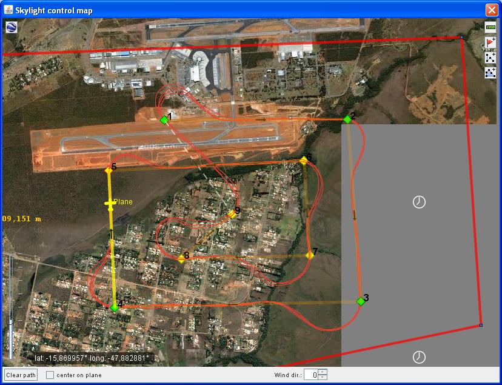
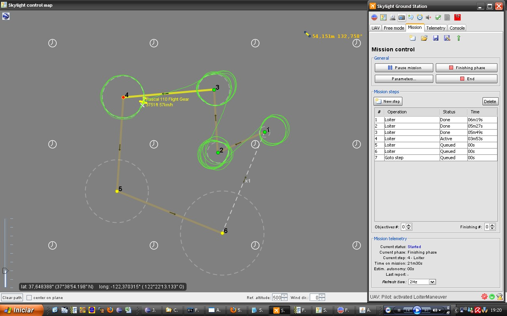
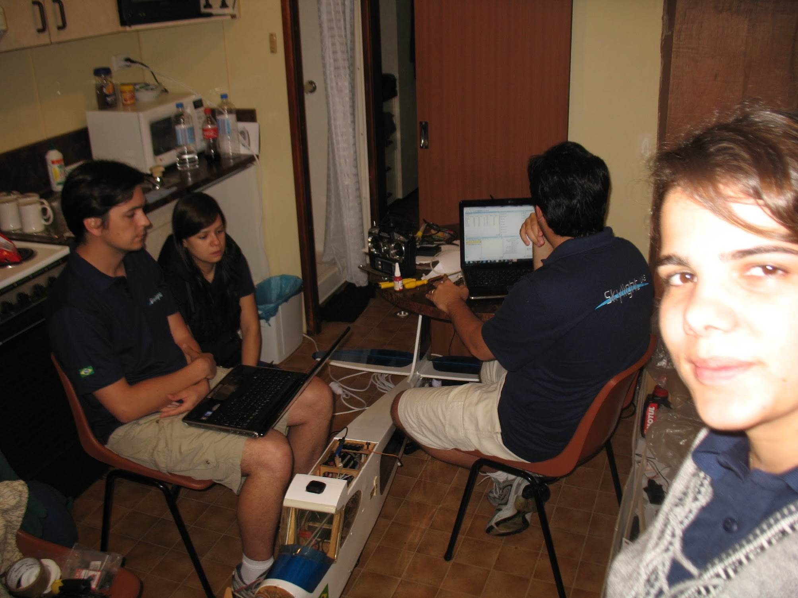

# skylight-uas
This is a complete Unmanned Aerial System composed of an Autopilot, along with a Ground Station, VSM, embedded eletronics for sensors and actuators, low and high level controls, all compatible with OTAN's STANAG 4586. We created this system while competing at the [UAV Outback Challenge at Australia](https://uavchallenge.org/). We (me and [Eduardo Steinhorst](https://github.com/edusteinhorst)) designed this between 2008 and 2010.

We created almost the entire system from scratch: Autopilot software, Sensors and Actuators hardware/embedded software, Ground station software, mission planner, RF and engine tweaks, software and hardware in the loop adapters, Camera stabilization software and the bottle release mechanism.

Tons of testing in simulators were used for security and budget reasons (we even created a simple flight dynamics simulator for smoke tests during our dev pipeline and used XPlane/FlightGear por more complete tests for bad weather). It was amazing to see Rascal fly autonomously on our first field test, keeping row, yaw and pitch attitude using a Nokia N95 "computer" with the "autopilot" app (our first system architecture). Lots of things to enhance there, but they are great memories with no footage (we were absolutelly concentrated on our planned tasks/procedures there 😅)! Maybe someday I will come back to work with this kind of beauty...

* [See here our presentation at Outback Challenge 2010](https://github.com/flaviostutz/skylight-uas/blob/master/docs/SkylightTeamPresentation.pdf)

* See some video recordings at
  * [Camera looking at fixed point while vehicle is loitering](https://youtu.be/FlndEQ9n3b8)
  * [Autopilot landing a Cesna while in loop with XPlane](https://youtu.be/2C-lTjXJ4d8)
  * [Autopilot landing a Rascal while in loop with FlightGear](https://youtu.be/yrF2cjR2COY)

* [Skylight Photo Album](https://photos.app.goo.gl/thvS9vkLZmswDzBD8)

## Design

This is the third version of the architecture of the UAS hardware and software.

The first version was based on a self made electronics with sensors and actuators. The Autopilot was a MIDP Java application installed on a N95 smartphone. The communications between N95 and sensor/actuators board was Bluetooth and the N95 to ground was through Wifi. In this version we used a lot of things that were ready, but as customization was needed we began to suffer.

At this point we decided to use a second version of the architecture with an onboard computer and a Java main application. In the middle of the refactoring process we realized some great improvements over energy usage, computer dimensions and software architecture, so we started the refactoring to our third version.

The third architecture version (current) relies on:
* 900MHz modem
* Gumstix computer
* Onboard Autopilot (based on plugins)
* Ground Station (based on plugins)
* [Rascal Model Airplane] (http://www.sigmfg.com/IndexText/SIGRC80.html)
* VSM for Ground Station to Vehicle coordination
* Communications, control and structure compatible with NATO's STANAG 4586 (in theory OTAN could control our Vehicle, and our Ground Station could control OTAN's drones)
* Self made electronics board for sensoring and actuation
* See /docs for more documentation (there are some documents that we sent to UAV Outback Challenge describing our system)

## Capabilities
* Long range operations (10km+)
* Custom payload control
* Assisted control (altitude, heading, airspeed, ground speed)
* Alert control systems
* Point and click mission plan designer
* Realtime telemetry of various system attributes
* Autopilot plugin extensibility
* GroundStation plugin extensibility
* Customizable emergency plans (loiter and wait for comms, goto comms point, goto landing site)
* Autonomous take-off/landing (tested only on realistic simulators but not on the real plane because of lack of DGPS)
* Fully autonomous operation on air (vehicle + payload) through mission plans (can be updated on air)
* Autonomous landing (tested only on simulators because we would need a RTK GPS for this)

* Skylight autopilot landing a Rascal model on FlightGear (click to play video)

* Skylight autopilot landing a Cesna model on XPlane (click to play video)

* Track waypoints test

* Loiter test

## UAV Outback Challenge
We started our project on 2008 and participated on 2010 at Kingaroy - Australia

* Final checks before heading to the airport to perform our presentation

* 4o place in the competition!

See more below:
* [Outback Challenge Facebook Group] (https://www.facebook.com/groups/177617904551/)
* [Outback Challenge 2010] (http://www.suasnews.com/outback-challenge-2010/)

## For building

* Start xQuartz in Mac

* Configure xQuartz to accept external connections in "Preferences..." -> Security -> Allow...

* Restart xQuartz

* docker-compose build

* docker-compose up

